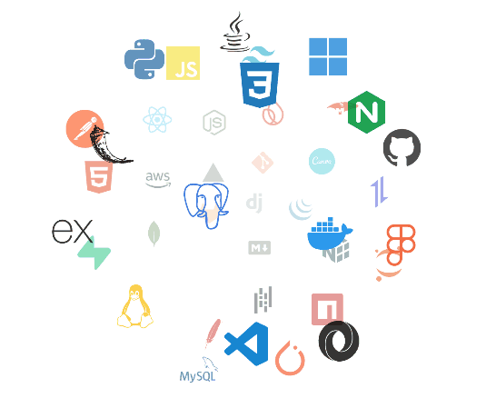

<!--Banner-->

  

<!--Header Name-->
## Data Engineer | Informatica | Power BI

<!--Start Intro-->
- 🌱 I’m currently expanding my expertise in cloud technologies, Databricks, and advanced data engineering workflows.
- 📊 Skilled in performance optimization, indexing, partitioning, and query tuning.
- 🛠 Experienced with Python, IICS, Teradata, and Linux environments.
- ❤ Dedicated to ensuring data accuracy, consistency, and implementing robust data quality frameworks.
- 💻 Visit my professional links below for more details about me.
<!--End Intro-->

---

### 🔗 Connect with Me

<!--Profile Count Badge & Inline Contact Buttons-->

  
  
  
  
  
  

---

<!--Tech Stack & Skills Section -->

<picture>
  <source media="(prefers-color-scheme: dark)" srcset="./Skills_Animation_Dark.gif">
  <source media="(prefers-color-scheme: light)" srcset="./Skills_Animation_White.gif">
  
</picture>

<h3 align="left">⚙️ Core Competencies</h3>
<ul align="left">
<li><b>Data Integration:</b> Informatica PowerCenter, IICS, Workflow Development, Data Transformation</li>
    <li><b>Dimensional Modeling:</b> Star & Snowflake Schema, SCD Type 1 & 2, CDC Implementation</li>
    <li><b>Databases & Performance:</b> Oracle 19c, Teradata, SQL Developer, Indexing, Partitioning, Query Tuning</li>
    <li><b>BI & Programming:</b> Microsoft Power BI, Python, SQL, PL/SQL, Databricks</li>
</ul>

<h3 align="left">💡 Key Professional Highlights</h3>
<ul align="left">
  <li><b>Enterprise Data Warehousing:</b> Architecting centralized star schema data marts and scalable ETL workflows at Acxiom Technology.</li>
  <li><b>Large-Scale Banking Solutions:</b> Spearheaded the integration of 40+ banking products and managed PySpark/Databricks ETL pipelines for Axis Bank.</li>
  <li><b>Automation & Data Governance:</b> Deployed trigger-based control workflows and Linux-based automated reporting systems to enforce rigorous data quality.
</ul> 

---

### 📜 Certifications & Licenses

&nbsp;  **Programming with Python CS50** &nbsp;&nbsp;&nbsp;&nbsp;&nbsp;&nbsp;Issued Oct 2026 &nbsp; | &nbsp; Credential ID: 96cc7fa1-4c72-4034-87d3-1134f3572a0d

&nbsp;  **Informatica Power Center** &nbsp;&nbsp;&nbsp;&nbsp;&nbsp;&nbsp;Issued Jul 2024 &nbsp; | &nbsp; Credential ID: UC-507ab09e-59e8-455d-83bb-b395809e8dde

&nbsp;  **Microsoft Power BI Desktop for Business Intelligence** &nbsp;&nbsp;&nbsp;&nbsp;&nbsp;&nbsp;Issued Jul 2024 &nbsp; | &nbsp; Credential ID: UC-464279b1-3649-4f1d-b14f-e218ce43978a

&nbsp;  **Automation Anywhere Certified Advanced RPA Professional** &nbsp;&nbsp;&nbsp;&nbsp;&nbsp;&nbsp;Issued Jul 2020 &nbsp; | &nbsp; Credential ID: AAADVC-20925161

&nbsp;  **UI Path Developer Foundation** &nbsp;&nbsp;&nbsp;&nbsp;&nbsp;&nbsp;Issued Jul 2020

---

### 💼 Freelance Projects

#### 🎓 Student Management Application
> *A comprehensive, Python-based desktop/web solution designed to streamline student registration, track financial ledgers, and deliver real-time analytics.*
* **Overview:** Built a centralized application to handle administrative workflows for educational institutes, eliminating manual paperwork and reducing ledger discrepancies.
* **Key Features:**
  * **Student Registration:** Seamless enrollment workflow capturing student profiles, course mapping, and academic details.
  * **Payment Ledger:** Automated financial tracking for fee submissions, pending dues, transaction histories, and receipt generation.
  * **Interactive Dashboard:** Real-time visual metrics displaying active enrollments, revenue trends, and fee collection summaries.
  * **Automated Reporting:** Generates downloadable reports for attendance, financial audits, and student performance.
* **Tech Stack:** Python, SQLite/MySQL, Pandas, Matplotlib / GUI Framework (Tkinter/PyQt or Web framework)

#### 🎨 Megical Floor Art — E-Commerce Website
> *A specialized, niche e-commerce platform and order management system curated for traditional decorative goods, ready-made rangolis, and festive floor art products.*
* **Overview:** Created a vibrant, user-friendly online marketplace and management system tailored specifically for art enthusiasts looking to purchase ready-to-use decorative floor designs.
* **Key Features:**
  * **Visual Product Showcase:** High-resolution galleries and categorized displays showcasing intricate rangoli patterns, festive decor items.
  * **Interactive Customer Experience:** Dynamic search, product filtering by tags/categories, price sorting, color variant selection, and interactive image lightboxes.
  * **Order Management Dashboard:** Admin panel featuring real-time GitHub repository integration (with local file fallback), admin authorization, and full CRUD operations for orders.
  * **Automated Billing & Invoicing:** Dynamic invoice generation with itemized costs, discount tracking, advance payment balance calculations, PDF export, and direct WhatsApp sharing.
  * **Responsive Design:** Optimized layout ensuring a smooth browsing and purchasing experience across mobile and desktop devices.
  * **Brand Identity Integration:** Custom color palettes and asset alignments matching the artistic and cultural essence of the products.

* **API Functionality & External Integrations:**
  * **GitHub REST API Integration:** Real-time repository integration within the Order Management Dashboard to sync data and execute complete CRUD operations for order management, supported by local storage fallback mechanisms.
  * **WhatsApp Sharing Integration:** Direct API/deep-linking integration enabling seamless delivery and sharing of generated invoices and billing details directly via WhatsApp.

* **Tech Stack:** HTML5, CSS3, JavaScript, Responsive Web Design Principles
---

<!-- Github stats Table -->
<h2 align="center">📊 Gɪᴛʜᴜʙ Sᴛᴀᴛs 📊</h2>

<table width="100%" border="0" cellspacing="0" cellpadding="0" style="border: none !important; border-collapse: collapse; background: transparent;">
  <!-- Row 1: GitHub Stats & Streak Stats -->
  <tr>
    <td width="50%" align="center" valign="top" style="border: none !important; background: transparent; padding: 5px;">
      
    </td>
    <td width="50%" align="center" valign="top" style="border: none !important; background: transparent; padding: 5px;">
      
    </td>
  </tr>

  <!-- Row 2: Most Used Languages & GitHub Trophies -->
  <tr>
    <td width="50%" align="center" valign="top" style="border: none !important; background: transparent; padding: 5px;">
      
    </td>
    <td width="50%" align="center" valign="top" style="border: none !important; background: transparent; padding: 5px;">
      
    </td>
  </tr>
</table>

 

<!--Footer-->

